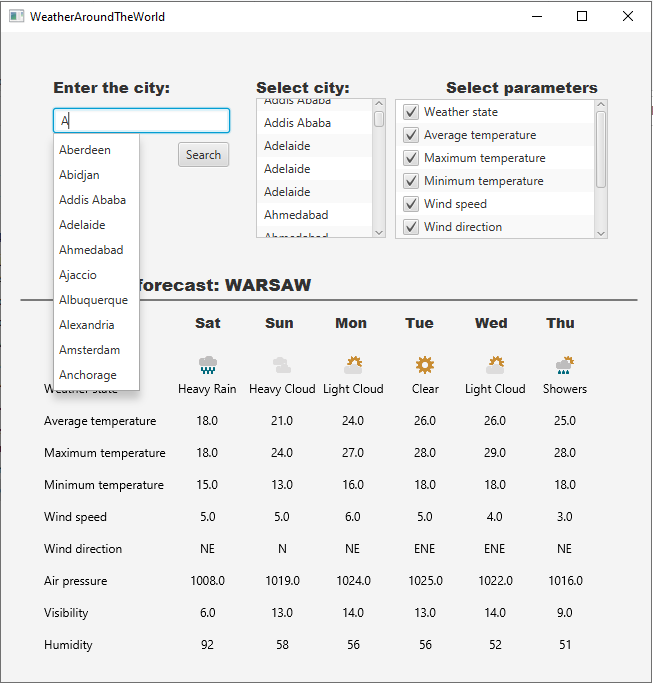

# Weather Application 
Desktop application which allow to check weather forecast for next 6 days in chosen place on earth. All date become from: https://www.metaweather.com/api

## Table of contents
* [General info](#general-info)
* [Screenshots](#screenshots)
* [Technologies](#technologies)

## General info
Simply desktop application allow to choose interested place and check expected weather and also parametrize prediction to interesting us values. 

## Screenshots

## Technologies
* Java 8
* JavaFX
* GSON
* HttpClient 

